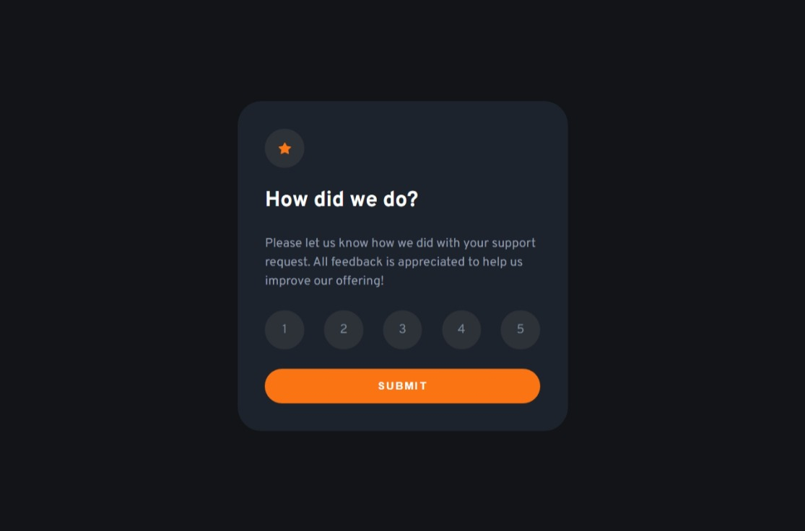
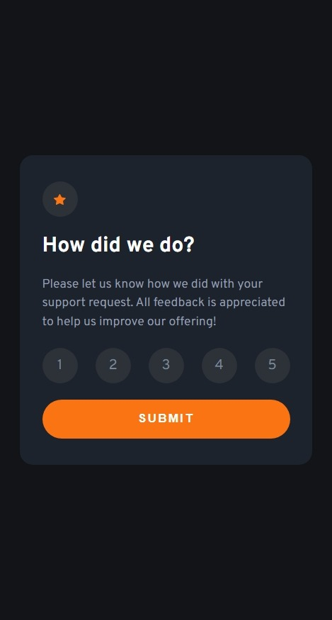

# Frontend Mentor - Product preview card component solution

This is a solution to the [Product preview card component challenge on Frontend Mentor](https://www.frontendmentor.io/challenges/product-preview-card-component-GO7UmttRfa). Frontend Mentor challenges help you improve your coding skills by building realistic projects. 

## Table of contents

- [Frontend Mentor - Product preview card component solution](#frontend-mentor---product-preview-card-component-solution)
  - [Table of contents](#table-of-contents)
  - [Overview](#overview)
    - [The challenge](#the-challenge)
    - [Screenshot](#screenshot)
      - [Desktop Mode](#desktop-mode)
      - [Mobile Mode](#mobile-mode)
    - [Links](#links)
  - [Usage](#usage)
  - [My process](#my-process)
    - [Built with](#built-with)
    - [Useful resources](#useful-resources)
  - [Author](#author)
  - [Acknowledgments](#acknowledgments)

## Overview

### The challenge

Users should be able to:

- View the optimal layout depending on their device's screen size
- See hover and focus states for interactive elements

### Screenshot

#### Desktop Mode


#### Mobile Mode


### Links
- Live Site URL: [product-preview-card-component-mh.netlify.app](https://interactive-rating-component-mh.netlify.app/)

## Usage

```bash
  git clone https://github.com/MrMohammedMath/interactive-rating-component

  cd interactive-rating-component

  npm install
```

- for running dev server

```bash
npm run dev
```

- for build & review

```bash
npm run build && npm run preview
```

## My process

### Built with

- Semantic HTML5 markup
- Flexbox
- Mobile-first workflow
- [SCSS](https://sass-lang.com/s) - Superset of CSS
- [BEM](https://en.bem.info/) - Block Element Modifier
- [React](https://reactjs.org/) - JS library

### Useful resources

- [Define an &lt;img&gt;'s src attribute in CSS](https://stackoverflow.com/questions/2676436/define-an-imgs-src-attribute-in-css)

## Author

- Frontend Mentor - [@Mohammed Hassan](https://www.frontendmentor.io/profile/MrMohammedMath)

## Acknowledgments
- Inspriation by [Frontend Mentor](https://www.frontendmentor.io/home)